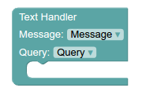
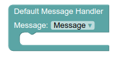
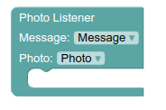

# پازل های event

هر فعالیتی که بخواهید انجام دهید می بایست در یک event قرار بگیرد.
در واقع برای اینکه بتوانیم پیام ارسال شده توسط کاربر تلگرام را استفاده کنیم باید از این پازل ها استفاده کنیم. می توانیم به دنبال متن یا دستور خاصی از کاربر باشیم و یا فایلی که ارسال می شود. برای استفاده از هر کدام از این موارد باید 

به عنوان مثال در تصویر بالا در مقابل Message می بایست متغیری که در آن پیام ارسالی ذخیره شده است را قرار داد.
این بخش برای تمام پازل هایی که پایین تر توضیح می دهیم نیز وجود دارد.

مقابل Query می بایست متغیری که در آن متن پیام ارسال شده ذخیره شده است را نشان داد.

مقابل Command عبارتی که در مقابل آن بات ما بفهمد که چه فعالیتی انجام دهد را قرار می دهیم.

در مثال بالا با ارسال دستور /start پازل هایی که دراین پازل Event قرار داده ایم اجرا می شوند.

## پازل text handler

## پازل Default Message handler

برای استفاده از این پازل فقط نیاز به مشخص کردن متغیری که در آن پیام ارسال شده ذخیره شده است، داریم.

برای استفاده از هر بخش پیام می بایست از پازل [ابجکت](http://puzlime.com/wiki/objects.md) استفاده کرد. ([ابجکت های تعریف شده برای هر پیام در تلگرام](https://core.telegram.org/bots/api#message))

## پازل photo listener

اگر بخواهیم بات ما در مقابل عکسی که از کاربر دریافت عملی انجام دهد، می بایست از این پازل استفاده کنیم.

در این پازل کل پیام ارسال شده توسط کاربر Message می باشد و Photo آرایه ای از فایل های عکس ارسال شده در کیفیت های مختلف است.

## پازل video listener

در این پازل پس از مشخص کردن متغیری که در آن پیام ذخیره شده است، متغیری که در آن video ارسال شده، ذخیره شده است را نیز مشخص می کنیم.

سپس  دیگر پازل های مورد نظر خود را در داخل این پازل اضافه می کنیم.

پازل های **voice listener, document listener, audio listener, sticker listener, location listener** نیز همانند پازل video listener عمل می کنند.

### پازل inline handler و callback handler

طرز استفاده از این پازل ها در[انواع کلید ها](http://puzlime.com/wiki/keyboard.md) توضیح داده می شود.

