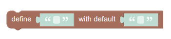
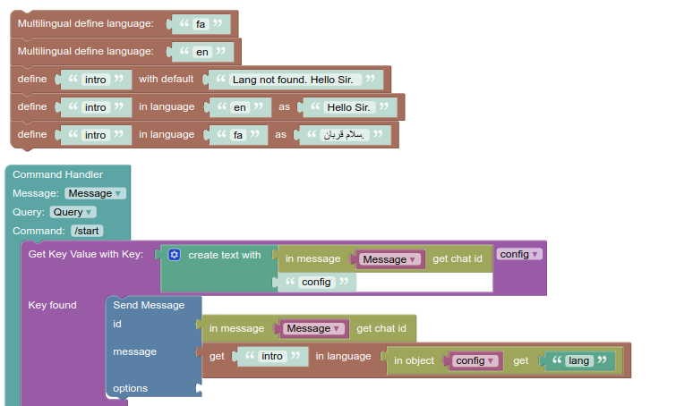

#  پازل های multilingual

برای اینکه بات شما چند زبان را پوشش دهد می بایست از پازل های multilingual استفاده کرد. به عنوان مثال 
برای کلمه hello  ، کلمه سلام برای زبان فارسی بات ذخیره می کنیم.

ابتدا برای اینکه زبان جدیدی تعریف کنیم باید از پازل زیر استفاده کنیم.

این پازل برای تعریف کردن عبارتی در یک زبان دیگر است. در جای خالی اول متن مورد نظر در زبان مبدا را قرار می دهیم. در جای خالی دوم زبان مقصد را مشخص می کنیم
سپس معادل متن مربوطه در زبان مقصد را در جای خالی سوم قرار می دهیم. 

در این پازل تعریف می کنیم اگر پیامی به زبان تعریف نشدای به بات فرستاده شود،چه پیامی درنظر بگیرد.

با استفاده از این پازل متن را در جای خالی اول قرار می دهیم و زبان مقصد را در جای خالی دوم قرار می دهیم.
در نتیجه متنی که از قبل معادل آن را در زبان مقصد مشخص کرده ایم به عنوان خروجی پازل می دهد.

مثال: 

