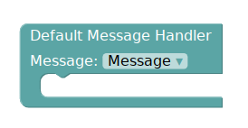
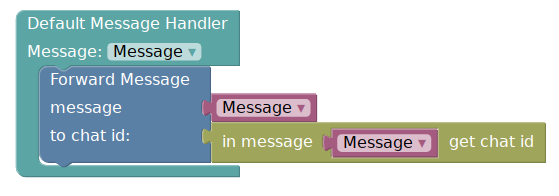

# ساخت یک بات
## دریافت توکن و افزودن به پازلایم
برای ساخت یک بات ابتدا به [@botfather](http://telegram.me/botfather) پیام دهید و با دستور `/newbot` یک بات بسازید.

سپس به صفحه [profile](http://puzlime.com/profile) رفته و token دریافتی خود را در انتهای صفحه وارد کنید.

## کد زدن
در کارت جدید ایجاد شده برای باتتان بر روی دکمه code کلیک نمایید.

میخواهیم باتی بسازیم که با دریافت هر پیام آن را مجددا فوروارد کند.

برای این کار از منوی Events گزینه Default Message handler را انتخاب می کنیم.

سپس در درون آن پازل، پازل forward را از منوی Message -> Send انتخاب نمایید.

پس از پایان کار، از منوی بالا گزینه save را انتخاب کنید. حال به صفحه پروفایل برگشته و باتتان را start کنید.

**تذکر**: پس از هر تغییر در کد برای اعمال تغییرات باید سیو کرده و سپس بات را restart نمایید.

حال می توانید به باتتان پیام دهید.
