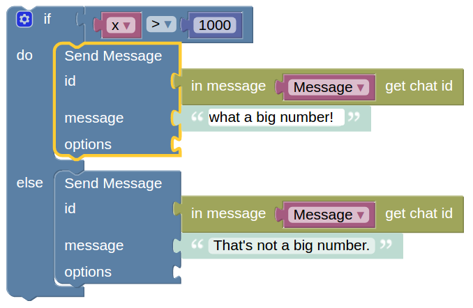

# منطق
جبر بولی یک سیستم ریاضی است که دو مقدار دارد :

* صحیح

* غلط

مقادیر بولی (نیز نامیده می شود شرایط ) در این بلوک کنترل، که شامل نمونه استفاده می شود:

* [بلوک های شرطی](http://puzlime.com/wiki/if.md)

* [بلوک های حلقه](http://puzlime.com/wiki/loops.md)

یک مثال ساده: 

اگر متغیر x بزرگتر از 1000 باشد، شرط صحیح می باشد و متن "What a big number!" فرستاده می شود. اگر متغیر x کوچکتر یا مساوی 1000 باشد، شرط غلط می باشد و متن "That's not a big number." فرستاده می شود.

