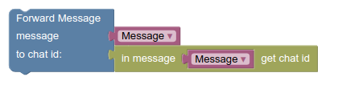
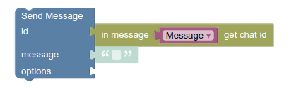
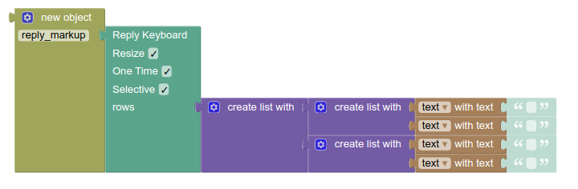
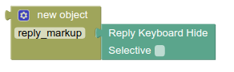
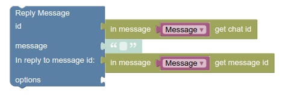
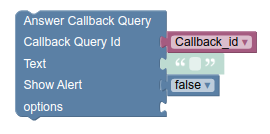
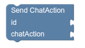
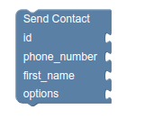

## پازل های Messages

برای ارسال هرگونه پیامی از طرف بات از این پازل ها استفاده می کنیم.

### Forward message

این پازل برای forward پیام ها استفاده می شود.
در قسمت اول(مقابل message) این پازل شئ (object) مربوط به پیام را قرار می دهیم.
در قسمت دوم id مربوط به چت مقصد را قرار می دهیم.(گروه ، شخص خاص، کانال)

### Send message

برای ارسال پیام به صورت متن(text) از این پازل استفاده می کنیم.
در قسمت اول این پازل id چت مورد نظر را قرار می دهیم.
در قسمت دوم (مقابل message) متن مورد نظر خود را قرار می دهید.

پازل های send photo, send video, send audio, send document, send video note, send voice به همین شکل هستند ولی به جای متن، id فایل مورد نظر را قرار می دهیم. 

قسمت آخر(options) برای کار های زیر استفاده می شود:

۱- نشان دادن کلید های inline

۲- نشان دادن کلید های ساده
 

۳- حذف کلید های ساده

۴- قرار گرفتن در حالت جواب دادن(reply) به یک پیام خاص

### Reply message

این پازل همانند پازل Send message است،
تفاوت این دو پازل در قسمت in reply to message است
که id مربوط به پیامی که می خواهیم به آن جواب دهیم را مقابل آن قرار می دهیم.

### Answer callback query

زمانی که از کلید های شیشه ای استفاده می کنید، می توانید از این پازل استفاده کنید تا به کاربر پیغام یا هشدار دهید.
متنی که مقابل text قرار می دهید در وسط صفحه برای کاربر ظاهر می شود.

بخش show alert برای این است که مطمئن شوید کاربر متن ارسالی را دیده است.

به این صورت که اگر false باشد، بعد چند ثانیه پیام محو می شود. ولی اگر true باشد، کاربر باید دکمه ok را بزند تا پیام محو شود.

### Answer inline

با استفاده از این پازل می توانید بات هایی مانند (@gif)[https://telegram.me/gif] ساخت

برای نحوه استفاده به صفحه مربوط به (کیبورد)[https://puzlime.com/wiki/keyboard.md] مراجع کنید

## پازل های غیر متعارف

### ChatAction

اگر بات شما برای انجام فعالیتی زمان قابل ملاحظه ای را در بر می گیرد می توانید از این پازل استفاده کنید تا به کاربر اطلاع دهید که بات در حال فعالیت است و متوقف نشده است(به جای اینکه پیام بدهید مثلا "در حال پردازش اطلاعات")
برای نمونه می توانید بات [ImageBot](https://t.me/imagebot) را امتحان کنید.

زمانی که بات پردازش خود را انجام می دهد، زیر اسم بات متن sending photo... دیده می شود.
برای اینکار شما کافی است که یکی از متن های زیر را مقابل chatAction قرار دهید: 

1. typing 

2. upload_photo

3. upload_video, record_video

4. upload_audio, record_audio

5. upload_document

6. find_location

7. upload_video_note, record_video_note

### Send Location

تنها تفاوت این پازل با پازل مربوط به فرستادن پیام این است که برای فرستادن مکان در تلگرام به عرض جغرافیایی (latitude) و طول جغرافیایی (longitude) نیاز داریم 

### Send Venue

در venue علاوه بر عرض و طول جغرافیایی، اسم مکان و آدرس مربوطه نیز تعریف شده است. برای استفاده از این پازل ابتدا عرض و طول جغرافیایی را همانند پازل send location قرار می دهید و برای address و title هر کدام متنی را به منظور آدرس و اسم مکان مورد نظر نیز در بخش خود قرار می دهید.

### Send Contact

این پازل برای ارسال مخاطب های است، تنها فرق این پازل با بقیه پازل های send این است که علاوه بر شماره تماس مخاطب، اسم ایشان نیز باید وارد شود.

