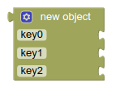
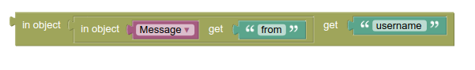

# پازل های object

به یک نمونه موجودیت از مفهوم انتزاعی object یا شئ می گوییم.
یک شئ در واقع  دارای رفتار ها و خصوصیاتی هست که ما آن شئ را با ایم تعاریف میشناسیم.

پازل پایین بیشتر برای اضافه کردن [کلید](http://puzlime.com/wiki/keyboard.md) به پیام و [پایگاه داده](http://puzlime.com/wiki/database.md) استفاده می شود. 

## پازل دریافت object

برای اینکه بتوانیم به خصوصیت های هر object دسترسی داشته باشیم باید از پازل زیر استفاده کنیم

به عنوان مثال:

در این مثال با استفاده از خصوصیت هایی که برای [شئ message](https://core.telegram.org/bots/api#message) در تلگرام تعریف شده است،  خصوصیت from را دریافت می کنیم که به ما [شئ user](https://core.telegram.org/bots/api#user) را می دهد. username رشته است که تلگرام در آن نام کاربری شما را ذخیره می کند. یه عنوان مثال @BotFather

## پازل حذف object

این پازل برای حذف یک خصوصیت از object استفاده می شود. به صورتی که نام object مورد نظر در جای خالی اول و اسم از قبل تعریف شده خصوصیت مورد نظر قرار می گیرند.

## پازل بررسی object

این پازل بررسی می کند که آیا خصوصیتی به اسمی که در جای خالی دوم قرار می گیرد، در object که در جای خالی اول قرار دارد، وجود دارد یا خیر.

## پازل به روز رسانی object

با این پازل خصوصیت یک object تعریف می کنیم. در جای خالی اول object ،جای خالی دوم خصوصیت مورد نظر، جای خالی سوم متغیری که می خواهیم به خصوصیت مربوطه نسبت دهیم.

## پازل تبدیل object به متن

با ساتفاده از این پازل می توانیم object مورد نظر خود را به متن تبدیل کنید. خروجی این پازل متن است.

