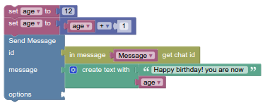

# متغیر ها

ما مجموعه متغیرها را همان گونه که در ریاضیات و دیگر زبان های برنامه نویسی استفاده می شود به کار می بریم : مقدار متغیر می تواند تغییر کند. متغیر ها می توانند به راه های مختلف ساخته شوند.

* هر پازل [count with](http://puzlime.com/wiki/loops.md) و [for each](http://puzlime.com/wiki/loops.md) از متغیر ها استفاده کرده و مقدار ها را مشخص می کند. این مقدار ها تنها در همین پازل استفاده می شوند .یک مثال کلاسیک علوم کامپیوتر در این مورد ["loop variables"](https://en.wikipedia.org/wiki/Loop_variable) است.

*   کاربر تابع ها را تعریف می کند که می تواند ورودی ها را نیز تعریف کند ٫ که موجب تعریف متغیر هایی می شود که می توان آن ها را داخل تابع به کار برد. که به صورت کلاسیک "[parameters](https://en.wikipedia.org/wiki/Parameter)" یا "arguments" گفته می شوند

* کاربران ممکن است هر زمان میان  "set"  را به صورت کلاسیک "[global variables](https://en.wikipedia.org/wiki/Global_variables)" می گویند . در تمام پازل نمی توان از  پازل  متغیر تعریف کنند . این متغیر ها"[local variables](https://en.wikipedia.org/wiki/Local_variable)" استفاده کرد.

## اسم های پیش فرض

اگر چه کاربر می تواند هر اسمی را برای متغیر ها انتخاب کند اما هسته پازل نیز اسم پیش فرض  "item"  را فراهم کرده است. همانگونه که در شکل زیر نمایش داده شده است . بعضی برنامه ها مقدار های پیش فرض  مانند"value"  

## فهرست کشویی

با کلیک بر روی نماد کرکره متغیر (مثلث) منوی زیر نمایش داده می شود:

منو گزینه های زیر را فراهم می کند :

* نام تمام متغیر ها در برنامه تعریف شده است.

* "Rename variable..." هر جا در برنامه باشد اسم متغیر را تغییر می دهد.انتخاب آن باعث می شود پنجره کوچکی باز شود که به کاربر اجازه می دهد نام جدید را به صورت متن وارد کند:  "Rename all %1 variables to:" این جا %1 با نام قدیمی (این جا "item") جایگزین می شود .

* "New variable..." به کاربر این اجازه را می دهد که اسم جدید برای متغیر وارد کند < بدون تغییر دادن یا جایگزین کردن متغیر ها با نام  قدیمی (این جا " item " ) . انتخاب کردن این گزینه پنجره کوچکی را برای کاربر باز میکند با متن "New variable name:"

# پازل ها

## تنظیم

پازل تنظیم یک مقدار را به متغیر نسبت می دهد  و متغیر را در صورت عدم وجود ایجاد می کند. برای مثال : این مقدار متغیر به نام "age " را 12 تنظیم می کند 

## دریافت

پازل دریافت ذخیره کردن مقدار یک متغیر را بدون تغیر در آن فراهم می کند .

این امکان وجود دارد اما ایده بدی است که در یک برنامه دریافت ظاهر شود بدون تنظیم.

# مثال

به عنوان مثال کد زیر را در نظر بگیرید:

اولین ردیف از پازل ها یک متغیر به نام "age" ایجاد می کند و مقدار اولیه آن را 12 تنظیم می کند .  ردیف دوم از پازل مقدار 12 را دریافت می کند و به آن 1 اضافه می کند و مجموع 13 را در متغیر ذخیره می کند . سطر آخر پیام  "Happy birthday! You are now 13" نمایش می دهد . 
